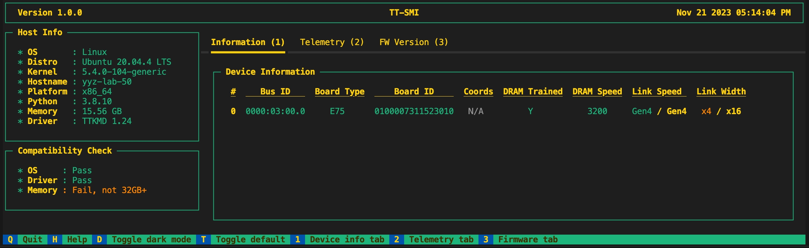
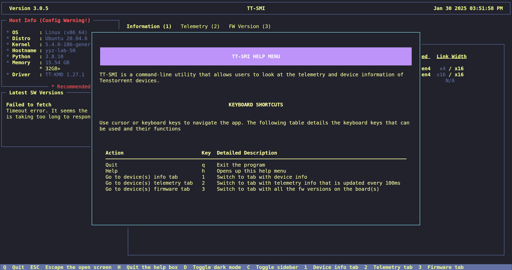

# TT-SMI

Tenstorrent System Management Interface (TT-SMI) is a command line utility
to interact with all Tenstorrent devices on host.

The main objective of TT-SMI is to provide a simple and easy-to-use interface
to display devices, device telemetry, and system information.

TT-SMI is also used to issue board-level resets.

> [!IMPORTANT]
> TT-SMI needs driver version ≥ 2.0.0 to work correctly. Please install the correct version from [tt-kmd](https://github.com/tenstorrent/tt-kmd).

> [!IMPORTANT]
> As of v3.0.35 we no longer support Grayskull Devices on TT-SMI.

> [!WARNING]
> Reset will not work on ARM systems since PCIe config is set up differently on those systems. Only way to perform a reliable board reset on those systems is to reboot the host.

## Official Repository

[https://github.com/tenstorrent/tt-smi/](https://github.com/tenstorrent/tt-smi/)

# Getting started

## Install Rust (if you don't already have it)

If Rust isn't already installed on your system, you can install it through either of the following methods:

### Using Distribution packages (preferred)

- **Fedora / EL9**

  `sudo dnf install cargo`

- **Ubuntu / Debian**

  `sudo apt install cargo`

### Using Rustup

```
curl --proto '=https' --tlsv1.2 -sSf https://sh.rustup.rs | sh
source "$HOME/.cargo/env"
```

## Installation (for users)

tt-smi is available on pypi and can be installed using pip (on Python v3.10 and up).

```
pip install tt-smi
```

### (Optional) Virtual environment
If you aren't doing a system-level install, install in a virtual environment.

```
python -m venv .venv
source .venv/bin/activate
pip install tt-smi
```

## Installation (for developers)

### Clone the repository

```
git clone https://github.com/tenstorrent/tt-smi.git
cd tt-smi
```

### Install
```
pip install .
```
or for users who would like to edit the code without re-building, install tt-smi in editable mode.
```
pip install --editable .
```
Recommended: install the pre-commit hooks so there is auto-formatting for all files on commit.
```
pre-commit install
```

# Usage

tt-smi can be used as a GUI (`tt-smi`) or CLI (`tt-smi -s`) to display system information and Tenstorrent device telemetry, and it can be used to reset Tenstorrent devices (`tt-smi -r`).

```
tt-smi [-h] [-l] [-v] [-s] [-ls] [-f [snapshot filename]] [-c] [-r [0,1 ...]] [--snapshot_no_tty] [-glx_reset] [-glx_reset_auto] [-glx_reset_tray {1,2,3,4}] [-glx_list_tray_to_device] [--no_reinit]
```

## Getting Help

Running tt-smi with the ```-h, --help``` flag displays the help text.

```
$ tt-smi -h
usage: tt-smi [-h] [-l] [-v] [-s] [-ls] [-f [snapshot filename]] [-c] [-r [0,1 ...]] [--snapshot_no_tty] [-glx_reset] [-glx_reset_auto] [-glx_reset_tray {1,2,3,4}] [-glx_list_tray_to_device]
              [--no_reinit]

Tenstorrent System Management Interface (TT-SMI) is a command line utility to interact with all Tenstorrent devices on host. The main objective of TT-SMI is to provide a simple and easy-to-use
interface to display devices, device telemetry, and system information. TT-SMI is also used to issue board-level resets.

options:
  -h, --help            show this help message and exit
  -l, --local           Run on local chips (Wormhole only)
  -v, --version         show program's version number and exit
  -s, --snapshot        Dump snapshot of current tt-smi information to STDOUT
  -ls, --list           List boards that are available on host and quit
  -f [snapshot filename], --filename [snapshot filename]
                        Write snapshot to a file. Default: ~/tt_smi/<timestamp>_snapshot.json
  -c, --compact         Run in compact mode, hiding the sidebar and other static elements
  -r [0,1 ...], --reset [0,1 ...]
                        Provide a list of PCI indices. Find PCI index of board using the -ls option. If no indices are provided, all devices will be reset
  --snapshot_no_tty     Force no-tty behavior in the snapshot to stdout
  -glx_reset, --galaxy_6u_trays_reset
                        Reset all the ASICs on the galaxy host
  -glx_reset_auto, --galaxy_6u_trays_reset_auto
                        Reset all ASICs on the galaxy host, but do auto retries up to 3 times if reset fails
  -glx_reset_tray {1,2,3,4}, --galaxy_6u_reset_tray {1,2,3,4}
                        Reset a specific tray on the galaxy
  -glx_list_tray_to_device, --galaxy_6u_list_tray_to_device
                        List the mapping of devices to trays on the galaxy
  --no_reinit           Don't detect devices post reset
  ```

These options will be discussed in more detail in the following sections.

## GUI
To bring up the tt-smi GUI run
```
$ tt-smi
```
This is the default mode where the user can view device information, telemetry, and firmware versions.



### Keyboard Shortcuts
All GUI keyboard shortcuts can be found in the help menu that user can bring up by pressing the `h` key or clicking the `help` button on the footer.



## Resets

Another feature of tt-smi is performing resets on Blackhole, Wormhole and Grayskull PCIe cards, using the  ```-r / --reset``` argument.


```
$ tt-smi -r 0,1 ..., --reset 0,1 ...
```

To perform the reset, provide a list of comma-separated PCI indices of the cards on the host. You can find PCI index of board using the -ls option. If no indices are provided, all devices will be reset.

TT-SMI will perform different types of resets depending on the device:
- Grayskull
  - Tensix-level reset that will reset each Tensix cores.
- Wormhole
  - A board-level reset will be perfomed. Power will be cut to the board and brought back up.
  - After reset, the ethernet connections will be re-trained.
- Blackhole
  - An ASIC-level reset will be perfomed.

By default, the reset command will re-initialize the boards after reset.

A successful reset on a system with a Wormhole N300 board looks like the following:

```
$ tt-smi -r
 Starting reset on devices at PCI indices: 0
 Waiting for 2 seconds for potential hotplug removal.
 Waiting for devices to reappear on pci bus...
 Reset successfully completed for device at PCI index 0.
 Finishing reset on devices at PCI indices: 0
 Re-initializing boards after reset....
 Detected Chips: 2
```

In order to find the correct device ID to call the reset on, the user can use the tt-smi board list function `tt-smi -ls` or `tt-smi --list`.
The dev id listed is the same as found on `/dev/tenstorrent/<dev pci id>`.
The generated output will include a list of all boards on host as well as the ones that can be reset.

```
$ tt-smi -ls

Gathering Information ━━━━━━━━━━━━━━━━━━━━━━━━━━━━━━━━━━━━━━━━ 100% 0:00:00
                All available boards on host:
┏━━━━━━━━━━━━┳━━━━━━━━━━━━┳━━━━━━━━━━━━━━━┳━━━━━━━━━━━━━━━━━━┓
┃ PCI Dev ID ┃ Board Type ┃ Device Series ┃ Board Number     ┃
┡━━━━━━━━━━━━╇━━━━━━━━━━━━╇━━━━━━━━━━━━━━━╇━━━━━━━━━━━━━━━━━━┩
│ 0          │ Grayskull  │ e75           │ 0100007311523010 │
│ 1          │ Wormhole   │ n300 L        │ 010001451170801d │
│ N/A        │ Wormhole   │ n300 R        │ 010001451170801d │
└────────────┴────────────┴───────────────┴──────────────────┘
                  Boards that can be reset:
┏━━━━━━━━━━━━┳━━━━━━━━━━━━┳━━━━━━━━━━━━━━━┳━━━━━━━━━━━━━━━━━━┓
┃ PCI Dev ID ┃ Board Type ┃ Device Series ┃ Board Number     ┃
┡━━━━━━━━━━━━╇━━━━━━━━━━━━╇━━━━━━━━━━━━━━━╇━━━━━━━━━━━━━━━━━━┩
│ 0          │ Grayskull  │ e75           │ 0100007311523010 │
│ 1          │ Wormhole   │ n300 L        │ 010001451170801d │
└────────────┴────────────┴───────────────┴──────────────────┘
```

## Galaxy resets

There are several options available for resetting Galaxy 6U trays.
  - glx_reset: resets the galaxy, informs users if an Ethernet failure has been detected
  - glx_reset_auto: same as -glx_reset, but resets up to 3 times if an Ethernet failure has been detected
  - glx_reset_tray <tray_num>: performs reset on one galaxy tray. Tray number has to be between 1-4

### Full galaxy reset
```
tt-smi -glx_reset
 Resetting WH Galaxy trays with reset command...
Executing command: sudo ipmitool raw 0x30 0x8B 0xF 0xFF 0x0 0xF
Waiting for 30 seconds: 30
Driver loaded
 Re-initializing boards after reset....
 Detected Chips: 32
 Re-initialized 32 boards after reset. Exiting...
```
### Tray reset
```
tt-smi -glx_reset_tray 3 --no_reinit
 Resetting WH Galaxy trays with reset command...
Executing command: sudo ipmitool raw 0x30 0x8B 0x4 0xFF 0x0 0xF
Waiting for 30 seconds: 30
Driver loaded
 Re-initializing boards after reset....
 Exiting after galaxy reset without re-initializing chips.
```
To identify the correct tray number for resetting specific devices, users can run `tt-smi -glx_list_tray_to_device / --galaxy_6u_list_tray_to_device`. This command displays a mapping table that shows the relationship between tray numbers, tray bus IDs, and the corresponding PCI device IDs, making it easier to target the appropriate tray for reset operations. Note that this command should not be run in a virtual machine (VM) environment as it requires direct hardware access to the Galaxy system.

```
$ tt-sml -glx_list_tray_to_device

Gathering Information ━━━━━━━━━━━━━━━━━━━━━━━━━━━━━━━━━━━━━━━━ 100% 0:00:00
      Mapping of trays to devices on the galaxy:
┏━━━━━━━━━━━━━┳━━━━━━━━━━━━━┳━━━━━━━━━━━━━━━━━━━━━━━━━┓
┃ Tray Number ┃ Tray Bus ID ┃ PCI Dev ID              ┃
┡━━━━━━━━━━━━━╇━━━━━━━━━━━━━╇━━━━━━━━━━━━━━━━━━━━━━━━━┩
│ 1           │ 0xc0        │ 0,1,2,3,4,5,6,7         │
│ 2           │ 0x80        │ 8,9,10,11,12,13,14,15   │
│ 3           │ 0x00        │ 16,17,18,19,20,21,22,23 │
│ 4           │ 0x40        │ 24,25,26,27,28,29,30,31 │
└─────────────┴─────────────┴─────────────────────────┘
```

## Snapshots

TT-SMI provides an easy way to get all the information that is displayed on the GUI in a json format using the ```-s / --snapshot``` argument. This prints the snapshot info directly to STDOUT.
Use the `-f` option to save the output to a file. By default the file is named and stored as ``` ~/tt_smi/<timestamp>_snapshot.json```, but users can also provide their own filename if desired.

Example usage:
```
$ tt-smi -f tt_smi_example.json

    Gathering Information ━━━━━━━━━━━━━━━━━━━━━━━━━━━━━━━━━━━━━━━━ 100% 0:00:00
      Saved tt-smi log to: tt_smi_example.json
```

```
$ tt-smi -s

    Gathering Information ━━━━━━━━━━━━━━━━━━━━━━━━━━━━━━━━━━━━━━━━ 100% 0:00:00
    {
        "time": "2025-02-04T13:04:50.313105",
        "host_info": {
            "OS": "Linux",
            "Distro": "Ubuntu 20.04.6 LTS",
            "Kernel": "5.15.0-130-generic",
        .........
```

## License

Apache 2.0 - https://www.apache.org/licenses/LICENSE-2.0.txt
