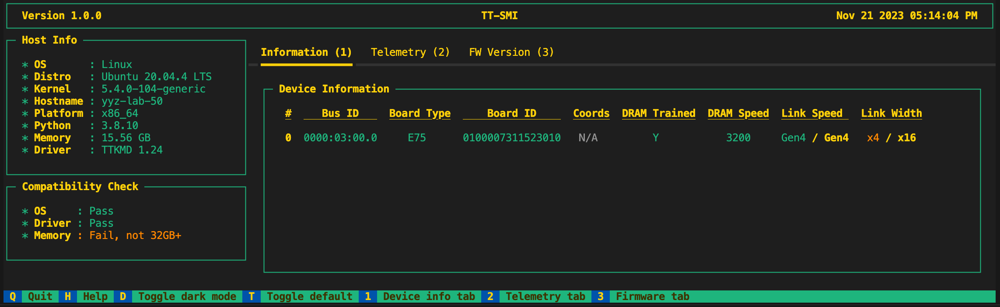
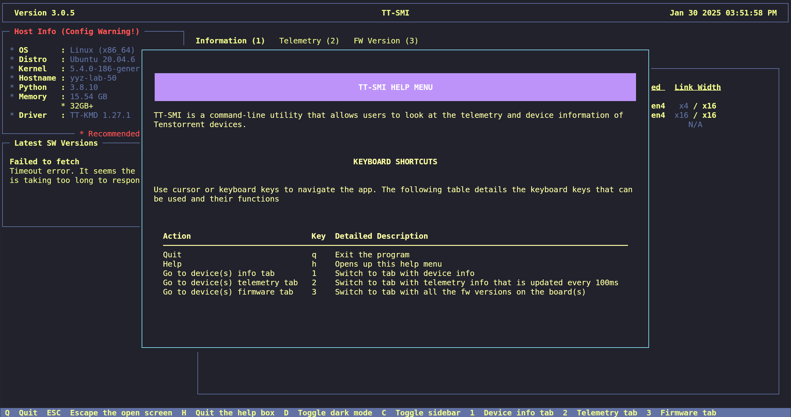

# TT-SMI

Tenstorrent System Management Interface (TT-SMI) is a command line utility
to interact with all Tenstorrent devices on host.

The main objective of TT-SMI is to provide a simple and easy-to-use interface
to display devices, device telemetry, and system information.

TT-SMI is also used to issue board-level resets.

# Important Notes

> [!IMPORTANT]
> As of v4.0.0 we are officially using [tt-umd](https://github.com/tenstorrent/tt-umd) as our backend. To use the [luwen](https://github.com/tenstorrent/luwen) backend, please use the `--use_luwen` flag. 
> Please file any issues you see with the `umd-backend` label

> [!IMPORTANT]
> TT-SMI needs driver version ≥ 2.0.0 to work correctly. Please install the correct version from [tt-kmd](https://github.com/tenstorrent/tt-kmd).

> [!CAUTION]
> As of v3.0.35 we no longer support Grayskull Devices on TT-SMI. Kernel mode driver support for Grayskull was depreciated in [ttkmd-2.2.0](https://github.com/tenstorrent/tt-kmd/releases/tag/ttkmd-2.2.0)

> [!CAUTION]
> Reset will not work on ARM systems since PCIe config is set up differently on those systems. Only way to perform a reliable board reset on those systems is to reboot the host.

## Official Repository

[https://github.com/tenstorrent/tt-smi/](https://github.com/tenstorrent/tt-smi/)

# Getting started

## Install Rust (if you don't already have it)

If Rust isn't already installed on your system, you can install it through either of the following methods:

### Using Distribution packages (preferred)

- **Fedora / EL9**

  `sudo dnf install cargo`

- **Ubuntu / Debian**

  `sudo apt install cargo`

### Using Rustup

```
curl --proto '=https' --tlsv1.2 -sSf https://sh.rustup.rs | sh
source "$HOME/.cargo/env"
```

## Installation (for users)

tt-smi is available on PyPI. We recommend running it with [`uvx`](https://docs.astral.sh/uv/guides/tools/), which ensures you always run the latest released version.

Install `uv` if you don't already have it:

```
curl -LsSf https://astral.sh/uv/install.sh | sh
```

Then run tt-smi:

```
uvx tt-smi@latest
```

Pass tt-smi flags after the package spec, e.g. `uvx tt-smi@latest -s`.

## Installation (for developers)

### Clone the repository

```
git clone https://github.com/tenstorrent/tt-smi.git
cd tt-smi
```

### Install

```
uv sync
```

This creates a `.venv` and installs tt-smi in editable mode along with its dependencies. Run the local build with `uv run tt-smi`, or activate the venv (`source .venv/bin/activate`) and use `tt-smi` directly.

Recommended: install the pre-commit hooks so there is auto-formatting for all files on commit.

```
uv run pre-commit install
```

# Usage

tt-smi can be used as a GUI (`tt-smi`) or CLI (`tt-smi -s`) to display system information and Tenstorrent device telemetry, and it can be used to reset Tenstorrent devices (`tt-smi -r`).

```
tt-smi [-h] [-l] [-v] [-s] [-ls] [-f [snapshot filename]] [-c] [-r [TARGETS ...]] [--snapshot_no_tty] [-glx_reset] [-glx_reset_auto] [-glx_reset_tray {1,2,3,4}] [-glx_list_tray_to_device] [--no_reinit]
```

## Getting Help

Running tt-smi with the ```-h, --help``` flag displays the help text.

```
$ tt-smi -h
usage: tt-smi [-h] [-l] [-v] [-s] [-ls] [-f [snapshot filename]] [-c] [-r [TARGETS ...]] [--snapshot_no_tty] [-glx_reset] [-glx_reset_auto] [-glx_reset_tray {1,2,3,4}] [-glx_list_tray_to_device] [--no_reinit] [--use_luwen]

Tenstorrent System Management Interface (TT-SMI) is a command line utility to interact with all Tenstorrent devices on host. The main objective of TT-SMI is to provide a simple and easy-to-use
interface to display devices, device telemetry, and system information. TT-SMI is also used to issue board-level resets.

options:
  -h, --help            show this help message and exit
  -l, --local           Run on local chips (Wormhole only)
  -v, --version         show program's version number and exit
  -s, --snapshot        Dump snapshot of current tt-smi information to STDOUT
  -ls, --list           List boards on the host and quit (UMD: UMD Chip ID, PCI BDF, PCI Dev ID, …)
  -f [snapshot filename], --filename [snapshot filename]
                        Write snapshot to a file. Default: ~/tt_smi/<timestamp>_snapshot.json
  -c, --compact         Run in compact mode, hiding the sidebar and other static elements
  -r [TARGETS ...], --reset [TARGETS ...]
                        Reset targets: UMD logical IDs, PCI BDFs (e.g. 0000:0a:00.0), or /dev/tenstorrent/<id>. Use -ls to list devices. Omit targets or use "all" to reset all devices. Do not mix types in one command.
  --snapshot_no_tty     Force no-tty behavior in the snapshot to stdout
  -glx_reset, --galaxy_6u_trays_reset
                        Reset all the ASICs on the galaxy host
  -glx_reset_auto, --galaxy_6u_trays_reset_auto
                        Reset all ASICs on the galaxy host, but do auto retries up to 3 times if reset fails
  -glx_reset_tray {1,2,3,4}, --galaxy_6u_reset_tray {1,2,3,4}
                        Reset a specific tray on the galaxy
  -glx_list_tray_to_device, --galaxy_6u_list_tray_to_device
                        List the mapping of devices to trays on the galaxy
  --no_reinit           Don't detect devices post reset
  --use_luwen           Use deprecated Luwen driver instead of UMD (default).
  ```

These options will be discussed in more detail in the following sections.

## GUI
To bring up the tt-smi GUI run
```
$ tt-smi
```
This is the default mode where the user can view device information, telemetry, firmware versions, and (when UMD is in use) the chip-to-chip ethernet topology.



The TUI has four tabs:

| Key | Tab | Notes |
| --- | --- | --- |
| `1` | Device information | bus id, board type, board id, coords, DRAM, PCIe link |
| `2` | Telemetry | voltage, current, AICLK, power, ASIC temperature, fan, heartbeat (refreshes ~10 Hz) |
| `3` | Firmware versions | bundle, CM, ETH, DM app, GDDR firmware versions |
| `4` | Topology | per-device ethernet links and a topology diagram (UMD only) |

### Keyboard Shortcuts
All GUI keyboard shortcuts can be found in the help menu that user can bring up by pressing the `h` key or clicking the `help` button on the footer.



## Listing devices

Use **`tt-smi -ls`** or **`tt-smi --list`** to print a table of Tenstorrent devices and exit (no GUI). This is the easiest way to see **UMD Chip ID**, **PCI BDF**, and **`/dev/tenstorrent/<n>`** (shown as **PCI Dev ID**) for each board—use these values with `tt-smi -r` as described in [Resets](#resets).

With the **UMD** backend (default), output includes two tables:

- **All available boards on host (UMD)** — every device TT-SMI discovered.
- **Boards that can be reset (UMD)** — devices eligible for `tt-smi -r`.

Column meanings:

| Column | Meaning |
|--------|---------|
| **UMD Chip ID** | Logical device index used for `tt-smi -r 0`, `tt-smi -r 1`, … |
| **PCI BDF** | PCI bus/device/function, e.g. `0000:01:00.0` — use with `tt-smi -r 0000:01:00.0` |
| **PCI Dev ID** | Kernel device node path, e.g. `/dev/tenstorrent/19` — use with `tt-smi -r /dev/tenstorrent/19` |
| **Board Type** | e.g. Blackhole, Wormhole |
| **Device Series** | Board SKU / series string |
| **Board Number** | Board serial identifier |

On large hosts (e.g. Galaxy), **UMD Chip ID** and **`/dev/tenstorrent/<n>`** are **not** always the same number—always use `-ls` to pick the correct target.

During discovery, **tt-umd** may print log lines (for example Ethernet heartbeat checks on Galaxy). Those messages are from the driver; the tables below still list the boards.

### Example: Blackhole Galaxy (32 ASICs, UMD)

Abbreviated output from a 32-board Galaxy system; your PCI BDFs and `/dev/tenstorrent/<n>` assignments will differ.

```
$ tt-smi -ls
… UMD may log info/warning lines during topology discovery …
Gathering Information ━━━━━━━━━━━━━━━━━━━━━━━━━━━━━━━━━━━━━━━━ 100% 0:00:00
                                All available boards on host (UMD):
┏━━━━━━━━━━━━━┳━━━━━━━━━━━━━━┳━━━━━━━━━━━━━━━━━━━━━┳━━━━━━━━━━━━┳━━━━━━━━━━━━━━━┳━━━━━━━━━━━━━━━━━━┓
┃ UMD Chip ID ┃ PCI BDF      ┃ PCI Dev ID          ┃ Board Type ┃ Device Series ┃ Board Number     ┃
┡━━━━━━━━━━━━━╇━━━━━━━━━━━━━━╇━━━━━━━━━━━━━━━━━━━━━╇━━━━━━━━━━━━╇━━━━━━━━━━━━━━━╇━━━━━━━━━━━━━━━━━━┩
│ 0           │ 0000:01:00.0 │ /dev/tenstorrent/19 │ Blackhole  │ tt-galaxy-bh  │ 0000047131831011 │
│ 1           │ 0000:02:00.0 │ /dev/tenstorrent/18 │ Blackhole  │ tt-galaxy-bh  │ 0000047131831011 │
│ 2           │ 0000:03:00.0 │ /dev/tenstorrent/25 │ Blackhole  │ tt-galaxy-bh  │ 0000047131831011 │
│ …           │ …            │ …                   │ …          │ …             │ …                │
│ 31          │ 0000:c8:00.0 │ /dev/tenstorrent/6  │ Blackhole  │ tt-galaxy-bh  │ 0000047131831011 │
└─────────────┴──────────────┴─────────────────────┴────────────┴───────────────┴──────────────────┘
                                  Boards that can be reset (UMD):
┏━━━━━━━━━━━━━┳━━━━━━━━━━━━━━┳━━━━━━━━━━━━━━━━━━━━━┳━━━━━━━━━━━━┳━━━━━━━━━━━━━━━┳━━━━━━━━━━━━━━━━━━┓
┃ UMD Chip ID ┃ PCI BDF      ┃ PCI Dev ID          ┃ Board Type ┃ Device Series ┃ Board Number     ┃
┡━━━━━━━━━━━━━╇━━━━━━━━━━━━━━╇━━━━━━━━━━━━━━━━━━━━━╇━━━━━━━━━━━━╇━━━━━━━━━━━━━━━╇━━━━━━━━━━━━━━━━━━┩
│ 0           │ 0000:01:00.0 │ /dev/tenstorrent/19 │ Blackhole  │ tt-galaxy-bh  │ 0000047131831011 │
│ …           │ …            │ …                   │ …          │ …             │ …                │
└─────────────┴──────────────┴─────────────────────┴────────────┴───────────────┴──────────────────┘
```

With **`--use_luwen`**, the table layout differs (no UMD Chip ID column); use **PCI BDF** and **`/dev/tenstorrent/<n>`** for `tt-smi -r` when using Luwen.

## Resets

Another feature of tt-smi is performing resets on Blackhole and Wormhole PCIe cards and galaxy machines, using the `-r` / `--reset` argument.

Reset targets are parsed as **one type per invocation** (do not mix UMD logical IDs, PCI BDFs, and `/dev/tenstorrent/<id>` paths in the same command).

### UMD (default backend)

With the UMD backend (default, no `--use_luwen`), `-r` accepts **four** kinds of input:

- **No arguments** or **`all`** — reset every detected device (`tt-smi -r` or `tt-smi -r all`).
- **UMD logical chip IDs** — comma-separated integers, e.g. `0`, `1`, `2` (same numbering as UMD device enumeration).
- **PCI BDF** — full address, e.g. `0000:0a:00.0` (comma-separated for multiple devices).
- **`/dev/tenstorrent/<id>`** — device node index, e.g. `/dev/tenstorrent/0`.

### Luwen (`--use_luwen`)

With the Luwen backend, `-r` accepts **three** kinds of input:

- **No arguments** or **`all`** — reset all devices discovered via Luwen.
- **PCI BDF** — as above.
- **`/dev/tenstorrent/<id>`** — as above.

**Note:** A bare integer (e.g. `0`) is **not** a valid Luwen reset target. Use the `/dev/tenstorrent/0` form instead.

- **Example (invalid with Luwen):** `tt-smi -r 0 --use_luwen`
- **Example (valid with Luwen):** `tt-smi -r /dev/tenstorrent/0 --use_luwen`

### Examples of valid resets

```bash
tt-smi -r 0000:0a:00.0,0000:0b:00.0
tt-smi -r /dev/tenstorrent/0,/dev/tenstorrent/2,/dev/tenstorrent/3
tt-smi -r 0,1,2                    # UMD logical IDs (UMD / default backend only)
tt-smi -r                          # or: tt-smi -r all
```

Use `tt-smi -ls` (or `tt-smi --list`) to list boards; see [Listing devices](#listing-devices) for UMD Chip ID, PCI BDF, and `/dev/tenstorrent/<id>` columns.

By default, the reset command will re-initialize the boards after reset. Use the `--no_reinit` arg to skip this.


## Galaxy resets

There are several options available for resetting Galaxy 6U trays.
  - Use the `-r/--reset` argument and treat it like any other pcie card. Warning - Needs CPLD FW v1.16 or higher. 
  - glx_reset: resets the galaxy, informs users if an Ethernet failure has been detected
  - glx_reset_auto: same as -glx_reset, but resets up to 3 times if an Ethernet failure has been detected
  - glx_reset_tray <tray_num>: performs reset on one galaxy tray. Tray number has to be between 1-4

### Full galaxy reset
```
tt-smi -glx_reset
 Resetting WH Galaxy trays with reset command...
Executing command: sudo ipmitool raw 0x30 0x8B 0xF 0xFF 0x0 0xF
Waiting for 30 seconds: 30
Driver loaded
 Re-initializing boards after reset....
 Detected Chips: 32
 Re-initialized 32 boards after reset. Exiting...
```
### Tray reset
```
tt-smi -glx_reset_tray 3 --no_reinit
 Resetting WH Galaxy trays with reset command...
Executing command: sudo ipmitool raw 0x30 0x8B 0x4 0xFF 0x0 0xF
Waiting for 30 seconds: 30
Driver loaded
 Re-initializing boards after reset....
 Exiting after galaxy reset without re-initializing chips.
```
To identify the correct tray number for resetting specific devices, users can run `tt-smi -glx_list_tray_to_device / --galaxy_6u_list_tray_to_device`. This command displays a mapping table that shows the relationship between tray numbers, tray bus IDs, and the corresponding PCI device IDs, making it easier to target the appropriate tray for reset operations. Note that this command should not be run in a virtual machine (VM) environment as it requires direct hardware access to the Galaxy system.

```
$ tt-sml -glx_list_tray_to_device

Gathering Information ━━━━━━━━━━━━━━━━━━━━━━━━━━━━━━━━━━━━━━━━ 100% 0:00:00
      Mapping of trays to devices on the galaxy:
┏━━━━━━━━━━━━━┳━━━━━━━━━━━━━┳━━━━━━━━━━━━━━━━━━━━━━━━━┓
┃ Tray Number ┃ Tray Bus ID ┃ PCI Dev ID              ┃
┡━━━━━━━━━━━━━╇━━━━━━━━━━━━━╇━━━━━━━━━━━━━━━━━━━━━━━━━┩
│ 1           │ 0xc0        │ 0,1,2,3,4,5,6,7         │
│ 2           │ 0x80        │ 8,9,10,11,12,13,14,15   │
│ 3           │ 0x00        │ 16,17,18,19,20,21,22,23 │
│ 4           │ 0x40        │ 24,25,26,27,28,29,30,31 │
└─────────────┴─────────────┴─────────────────────────┘
```

## Topology

TT-SMI can report the chip-to-chip ethernet topology of all detected Tenstorrent
devices, either inside the TUI (tab `4`) or from the command line via the
`--topology` flag.

The topology view is built from the UMD `ClusterDescriptor`, so it is **only
available when running with the UMD backend** (the default). If you pass
`--use_luwen`, the topology view is disabled.

### CLI usage

`--topology` accepts one of three output formats. When the flag is given
without a value, the default is `table`:

| Invocation | Output |
| --- | --- |
| `tt-smi --topology`         | Rich table with one row per chip / ethernet link |
| `tt-smi --topology table`   | Same as above |
| `tt-smi --topology json`    | Machine-readable JSON dump (one entry per device) |
| `tt-smi --topology diagram` | Unicode topology diagram — auto-selects `single` / `pair` / ring / adjacency listing |

Examples:

```
$ tt-smi --topology
            Device Topology (chip-to-chip ethernet)
┏━━━┳━━━━━━━┳━━━━━━━━┳━━━━━━━━┳━━━━━━━━━┳━━━━━━━┳━━━━━━━━━━━━━┓
┃ # ┃ Board ┃ Attach ┃ Eth Ch ┃ -> Chip ┃ -> Ch ┃    Link     ┃
┡━━━╇━━━━━━━╇━━━━━━━━╇━━━━━━━━╇━━━━━━━━━╇━━━━━━━╇━━━━━━━━━━━━━┩
│ 0 │ p150b │  PCIe  │   0    │    1    │   8   │   active    │
│   │       │        │   1    │    1    │   9   │   active    │
│ 1 │ p150b │  PCIe  │   8    │    0    │   0   │   active    │
│   │       │        │   9    │    0    │   1   │   active    │
└───┴───────┴────────┴────────┴─────────┴───────┴─────────────┘
```

```
$ tt-smi --topology diagram
             ┌── 4ch        ──┐
             │   (ch 0-3)     │
            [0]              [1]
             │                │
4ch          │                │    4ch
(ch 8-11)    │                │    (ch 4-7)
             │                │
            [3]              [2]
             │   (ch 12-15)   │
             └── 4ch        ──┘
```

The diagram automatically picks the most readable layout based on the detected
shape:

- **1 chip**: shows the chip token with a "single device" annotation
- **2 chips**: a two-row pair (`[a] ── 4ch ── [b]` plus a channel-range line)
- **3 chips**: a compact triangle
- **4 chips (ring)**: the boxed diagram shown above
- **5+ chip ring**: a ring listing `[0] → [1] → … → [0]` followed by per-edge entries
- **other shapes**: a per-chip adjacency listing as a graceful fallback

Each edge label is split into two lines:
- The first line shows the **channel count** (e.g. `4ch`).
- The second line shows the **channel range** (e.g. `(ch 4-7)`), with a
  `n/n up` warn suffix when some channels are down. For example, `4ch` /
  `(ch 0-3) 2/4 up` means four channels exist but only two are up.

```
$ tt-smi --topology json | jq '."0".links[0]'
{
  "eth_ch": 0,
  "rchip": 1,
  "rchan": 8,
  "active": true
}
```

If you pipe the JSON or diagram output to a non-TTY (for example into `jq` or a
log file), the output is the plain rendering with no terminal styling.

### TUI tab 4

In the TUI, switch to the topology tab with the `4` key. The left pane shows
the topology diagram (same renderer as `--topology diagram`); the right pane
shows the per-link table. Both update once on mount; they do not refresh while
the TUI is running because the cluster topology is static for a given session.

If you launch tt-smi with `--use_luwen`, the topology tab and `--topology`
flag both report that they require UMD mode and exit; no topology is rendered.

## Snapshots

TT-SMI provides an easy way to get all the information that is displayed on the GUI in a json format using the ```-s / --snapshot``` argument. This prints the snapshot info directly to STDOUT.
Use the `-f` option to save the output to a file. By default the file is named and stored as ``` ~/tt_smi/<timestamp>_snapshot.json```, but users can also provide their own filename if desired.

Example usage:
```
$ tt-smi -f tt_smi_example.json

    Gathering Information ━━━━━━━━━━━━━━━━━━━━━━━━━━━━━━━━━━━━━━━━ 100% 0:00:00
      Saved tt-smi log to: tt_smi_example.json
```

```
$ tt-smi -s

    Gathering Information ━━━━━━━━━━━━━━━━━━━━━━━━━━━━━━━━━━━━━━━━ 100% 0:00:00
    {
        "time": "2025-02-04T13:04:50.313105",
        "host_info": {
            "OS": "Linux",
            "Distro": "Ubuntu 20.04.6 LTS",
            "Kernel": "5.15.0-130-generic",
        .........
```

## License

Apache 2.0 - https://www.apache.org/licenses/LICENSE-2.0.txt
